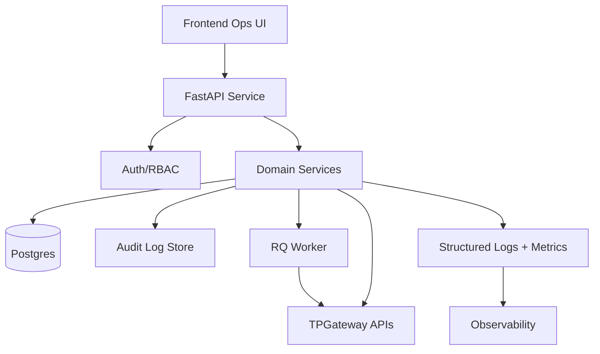
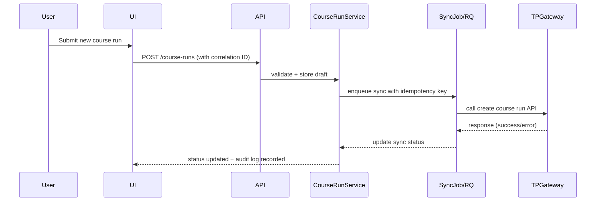
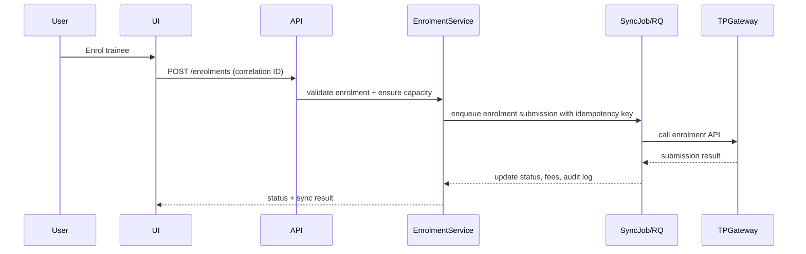
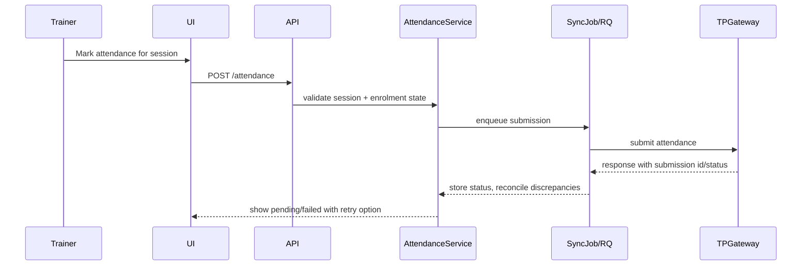
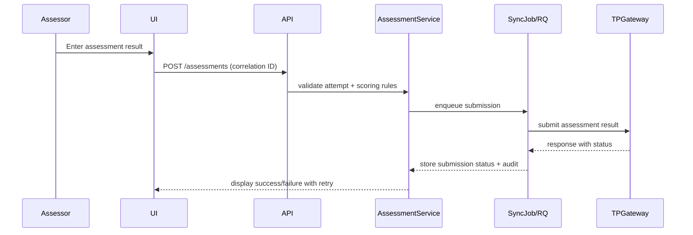

# Architecture Overview

This document outlines the MVP architecture for Hawker Boys TMS aligned to TPGateway compliance requirements.

## Modules
- **Auth & RBAC**: JWT-backed auth with roles enforced at API and UI. Supports correlation IDs per request.
- **Course Runs**: Manage local course runs, session schedules, sync state with TPGateway.
- **Enrolments**: Capture trainee data, fee state, sync submissions, and status checks.
- **Attendance**: Session-level capture with reconciliation against TPGateway submissions.
- **Assessments**: Record assessment results, updates/voids, and submission tracking.
- **Compliance Dashboard**: Status rollups, deadline alarms, dead-letter visibility.
- **Audit Logs**: Immutable append-only records for key mutations (course runs, enrolments, attendance, assessments, fees, role changes).
- **Sync Jobs**: Background worker (RQ) handling retries, idempotency, and error capture.

## High-Level Architecture

## Sequence: Create Course Run

## Sequence: Enrol Trainee

## Sequence: Attendance Reconcile

## Sequence: Submit Assessment

## Integration Patterns
- **Idempotency**: client-generated keys per submission; stored with sync jobs to prevent duplicates.
- **Retries/Backoff**: exponential backoff for transient errors; max attempts before dead-lettering.
- **Dead-Letter**: failed jobs captured with error context; surfaced on compliance dashboard for operator action.
- **Correlation IDs**: generated at UI, propagated through API, jobs, and outbound requests; logged in structured logs.
- **Structured Logging**: JSON logs including request ids, user, action, entity, result, latency.
- **Audit Trails**: append-only records with timestamps, actor, change summary, correlation ID, immutable by design.
- **Security**: never store secrets in code; use environment variables and secret manager; enforce RBAC on every endpoint.
