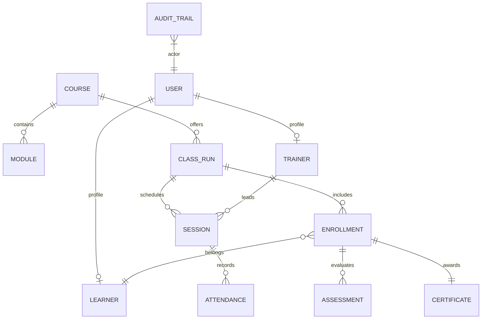
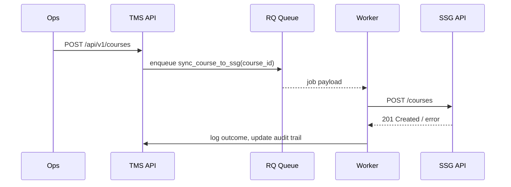
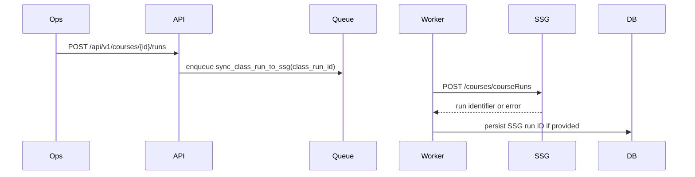
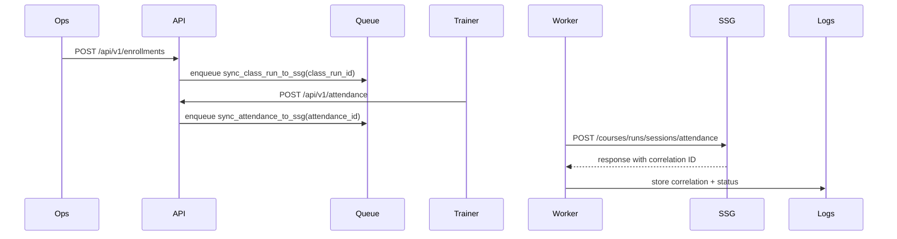

# Data Model and Integration Flows

## Entity Relationship Overview

- **Course** holds reusable module templates and high-level SSG course code.
- **ClassRun** references a course and captures run-specific metadata (start/end, status, SSG run ID).
- **Session** tracks session-level attendance and trainer assignments.
- **Learner** stores masked identifiers and contact details linked to optional user accounts for portal access.
- **Enrollment** links learners to class runs with status and SSG sync keys.
- **Attendance**, **Assessment**, and **Certificate** hang off enrollments for compliance artefacts.
- **AuditTrail** records sensitive CRUD and access events for PDPA traceability.

## SSG Sync Flows

### A. Course Creation and Publish

### B. Class Run Registration

### C. Learner Enrollment and Attendance Submission

### D. Claims Submission (placeholder)
> Future enhancement: After SSG releases claims endpoint for providers, extend worker to submit attendance-derived claims and store claim references for reconciliation.
